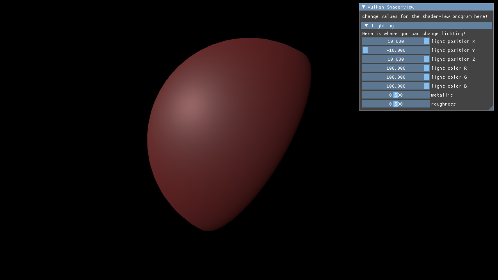

# vulkanshaderview
Nick Moon

[X] refactor code to use class-based wrappers for vulkan constructs

[X] learn and integrate imgui into rendering pipeline

[X] implement Cook-Torrance microfacet BRDF
